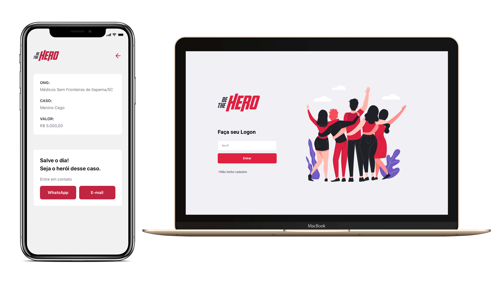

<h1 align="center">
    
</h1>

<h4 align="center">
  🚀 Semana OmniStack 11.0 by RocketSeat
</h4>

  
  

  

## 👨🏼‍💻 Projeto

O Be The Hero é uma aplicação que tem como objetivo auxiliar <b>ONGs</b> (Organização não governamental) a encontrar pessoas disposta a auxiliar em suas causas. Nele é possível as fazer cadastros de ONGs, cada ONG pode fazer o cadastro de seus casos, além de contar com um app mobile onde os “heróis” podem visualizar os casos e seus detalhes e através dele entrar em contato com a ONG. Foi desenvolvida durante a <b>Semana Omnistack 11.0</b>.

## 🔨 Tecnologias

- [JavaScript](https://developer.mozilla.org/pt-BR/docs/Aprender/JavaScript)
- [Node.js](https://nodejs.org/en/)
- [React](https://pt-br.reactjs.org/)
- [React Native](https://reactnative.dev/)
- [Expo](https://expo.io/)
- [SQLite](https://www.sqlite.org/index.html)
- [Jest](https://jestjs.io/pt-BR/)

## 🔄 Executar
 - Fazer clone do repositório.

### 🔧 Back-end
 - Entrar na pasta `backend`;
 - Executar `yarn install` para instalar dependências do projeto;
 - Executar `yarn dev` para que o projeto seja executado;

### 💻 Front-end
 - Entrar na pasta `frontend`;
 - Executar `yarn install` para instalar dependências do projeto;
 - Executar `yarn start` para que o projeto seja executado;

### 📱 Mobile
- Entrar na pasta `mobile`;
 - Executar `yarn install` para instalar dependências do projeto;
 - Executar `yarn start` para que o projeto seja executado;

## ♻️ Como contribuir
- Faça um fork desse repositório;
- Crie uma branch com a sua feature: `git checkout -b minha-feature`
- Commit suas mudanças: `git commit -m ':emoji: feat: My new feature'`
- Push a sua branch: `git push origin my-feature`

## 📝 Licença
Este projeto está sobre a licença MIT. Veja o arquivo [LICENSE](LICENSE.md) para mais detalhes.

---

<h4 align="center">
  Feito com ❤️ by Gustavo Souza
</h4>