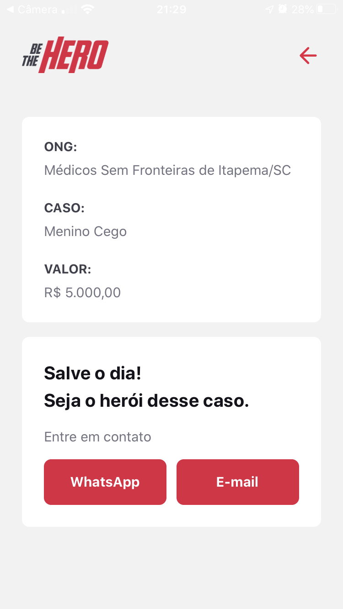

<h1 align="center">
    
</h1>

<h4 align="center">
  🚀 Semana OmniStack 11.0 by RocketSeat
</h4>

  
  

## 📱 Interfaces

    
     

## 🔄 Funcionamento

    

## 🏃 Executar
- Entrar na pasta `mobile`;
 - Executar `yarn install` para instalar dependências do projeto;
 - Executar `yarn start` para que o projeto seja executado;

 ## 📝 Licença
Este projeto está sobre a licença MIT. Veja o arquivo [LICENSE](../LICENSE.md) para mais detalhes.

---
<h4 align="center">
  Feito com ❤️ by Gustavo Souza
</h4>
